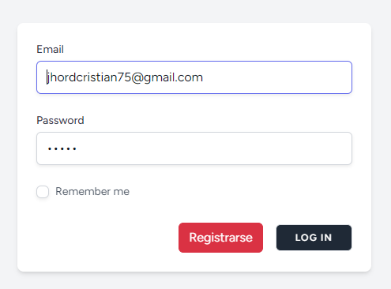
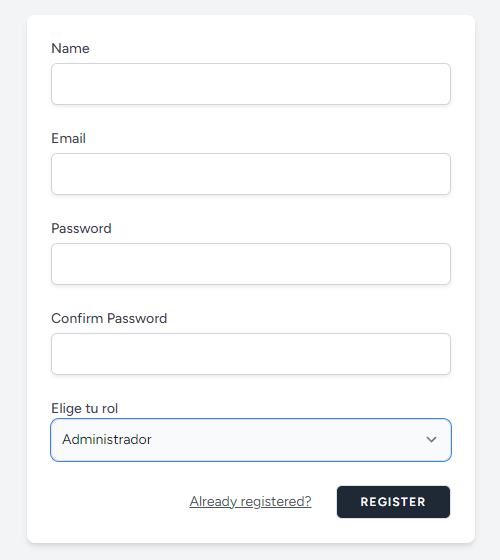
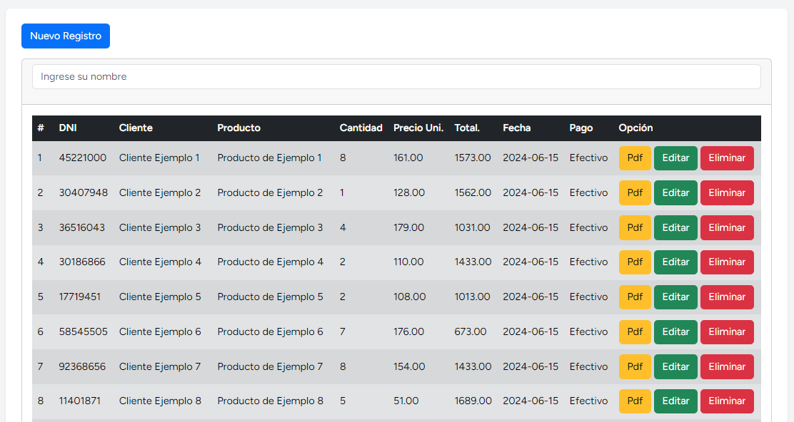
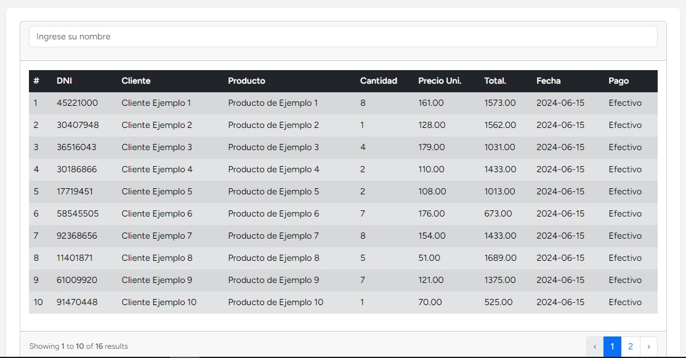
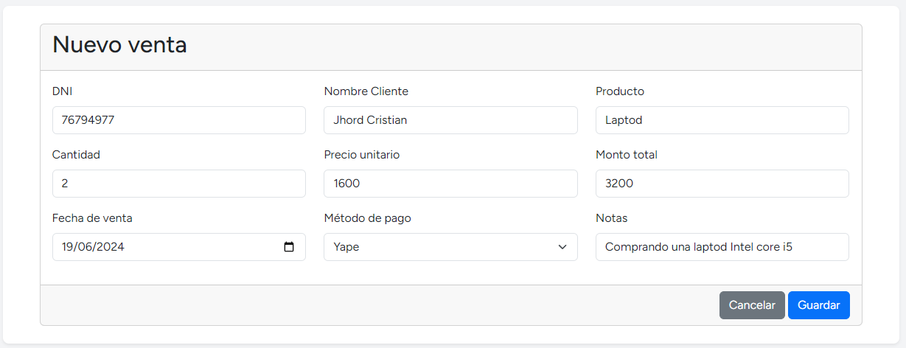
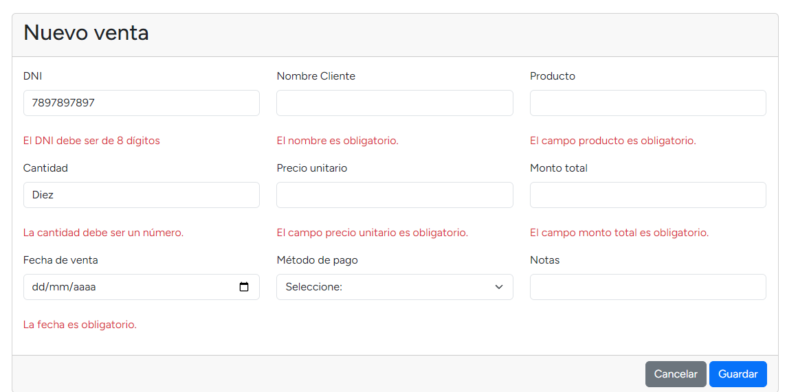
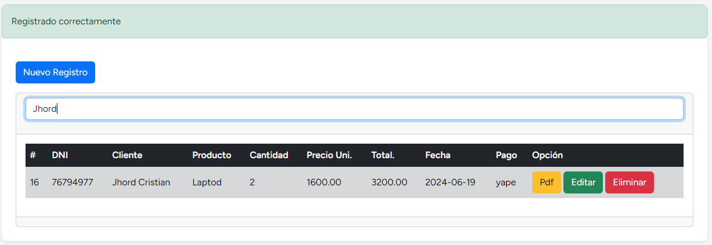
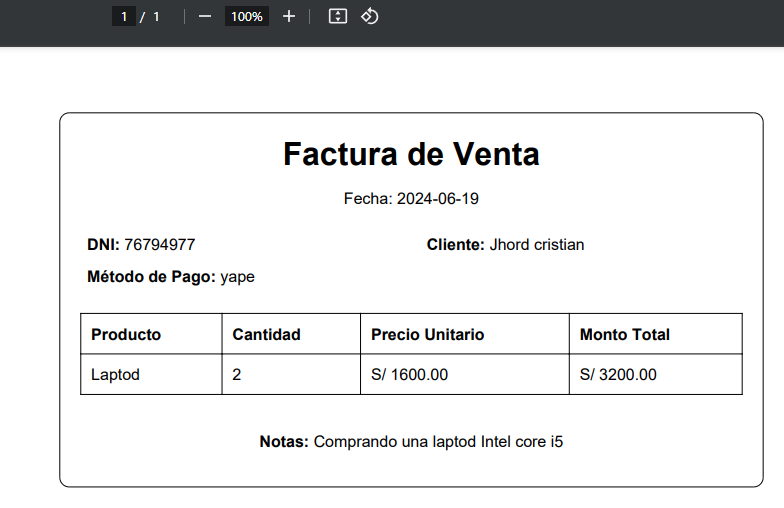

# Mi Proyecto
Este es mi pequeño proyecto desarrollado en laravel 10 con breeze
## Descripción
CRUD básico en Laravel 10 que permite gestionar ventas de ejemplo y generar PDFs demostrativos.
Incluye autenticación con Laravel Breeze y roles de usuario para gestionar permisos.

## Ejemplo

    ## Roles a elegir
    

      
      
    

    ## Modo administrador
    

        
    

    ## Modo usuario
    

        
    

    ## Creando nuevo registro
    

      
    

    ## Validaciones de campos
    

      
    

    ## Buscador con livewire
    

      
    

    ## Generando pdf
    

      
    

## Instalación
git clone https://github.com/Muchiwis/cv_crud_pdf_breeze.git

composer install

npm install

php artisan key:generate

php artisan migrate

php artisan DB:seed //cargar datos de ejemplo

npm run dev

npm run serve

